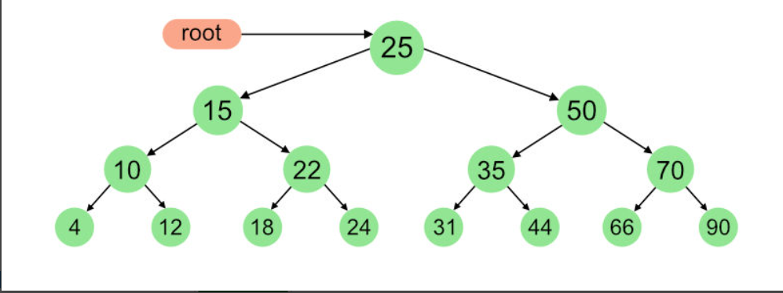

<h1>Binary Tree Structure</h1>

<h2>Introduction</h2>

This code is designed to create a binary tree using a class structure in Python. The code consists of two classes: one for creating the tree and another for each node in the tree.

<h2>File Structure</h2>

The code consists of two classes: "BinaryTree" and "BinaryTreeNode". The "BinaryTree" contains the main class structure for creating the decision tree, while the "BinaryTreeNode" class contains the structure for each node in the tree.

<h2>Class Structure</h2>

<h4>BinaryTreeNode:</h4>

As previously mentioned, the "BinaryTreeNode" class is responsible for creating each node in the tree, this class is only called by BinaryTree class that has the methods that will be used,its attributes and methods are: 

<strong>Attributes:</strong>

<ul>
    <li>index: Represents the index of the note</li>
    <li>left: The left child of the node (a "BinaryTreeNode" object)</li>
    <li>right: The right child of the node (a "BinaryTreeNode" object)</li>
    <li>children[]: Array containing the children of a node (array of "BinaryTreeNode" objects)</li>
    <li>parent[]: Array containing the parent of a node (array of "BinaryTreeNode" object)</li>
    <li>a: Vector containing the coefficients of the  &#x3A8 function</li>
    <li>data: A empty dictionary to store data in each node</li>
    <li>C_k: A list that stores all inputs x that have passed through node <strong>k</strong></li>
</ul>

<strong>Methods:</strong>

<ul>
 <li>__init__(self, index, left=None, right=None, children = [], parent = []): Responsible for creating the node, receives the index value of the node, as well as its left and right children, a list for its children and another for its parent node.</li>

<li>__repr__(self): Method that returns a string representation of an object. </li>

<li>__eq__(self, other): It takes two objects as an argument and returns a boolean value indicating whether the two objects are equal.</li>

<li>__str__(self, level=0):  It returns a string representation of the object that is suitable for display to end-users.</li>
         
<li>printTree(self): Used to call the printBTree method to print the tree, structure Example:   1</li>
                                                                                            ___/ \__
                                                                                           3        4
                                                                                       ___/ \__    / \
                                                                                      8        9  5   6
                                                                                     / \      / \
                                                                                    12   13  10   11
                                                                                            /  \
                                                                                           14    15
</ul>

<h4>BinaryTree:</h4>

<strong>Attributes:</strong>

<ul>
    <li>root_index: Represents the root index of the note, or the first Node</li>
    <li>nodes{}: a Dict that contains all nodes created in the tree</li>
    
</ul>

<strong>Methods:</strong>

<ul>
<li>__init__(self, root_index=None): Initializes the tree with the given root node (which defaults to None if not provided)</li>
</ul>
2 Methods to traversed in different ways were developed: in Order and Pos Order traversal, to ilustrate considere the follow image:

<ul>
    <li>traverse_inorder(self, node, reachable=None): Given the example in the figure, if the tree is traversed with the in order algorithm, the output would be: (4,10,12,15,18,22,24,25,31,35,44,30,66,70,90)</li>
    <li> traverse_postorder(self, node, reachable=None):Given the example in the figure, if the tree is traversed with the post order algorithm, the output would be: (4,12,10,18,24,22,15,31,44,35,66,90,70,50,25)</li>
    <li>add_Node(self, index, left_index=None, right_index=None): Add both the left and right child nodes to the given node (index), and also updates/ and or creates the list of children and parents of each node.</li>
    <li>del_Node2(self, index): Removes the selected node, and because it is a binary tree it also removes all subsequent children. We use the post order traversal algorithm to traverse the tree and get all child nodes.</li>
    <li>_height(self, node): Returns the size of the tree (in levels)</li>
    <li>size(self): Returns the number of nodes in the tree</li>
    <li>__repr__(self):   Traverse and display all nodes in the tree (use traversal in order)</li>
    <li>child(self, index, return_node = False): It has two options to return the child nodes of the node passed as a parameter, if return_node == False a list with the 2 children is returned, if return_node == True the 2 nodes are returned separately.</li>
    <li>parent(self, index, return_node = False): Given a node as a parameter, it returns its side left= 0, right= 1, and its parent node. The return method is the same as the child method where a list of information is returned or separated depending on whether return_node is True or false</li>
    <li>is_Leaf(self, index): Returns 1 if a node is a leaf and 0 otherwise</li>
    <li>Le (self): Returns a list of all leaves in the tree</li>
    <li>In (self): Returns a list of all non-leaf nodes</li>
    <li>printBTree(node, nodeInfo=None, inverted=False, isTop=True): Function called by the printTree function, to represent the structure of the tree visually in the console</li>

</ul>
<h2>Usage: </h2>

In Progress...

