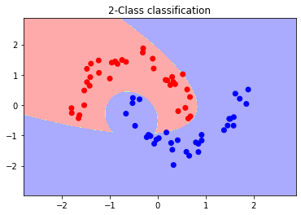

<h1>Decision trees with &#x3A8 entropy</h1>

<h2>Introduction</h2>

Main function for using entropy classifier

<h2>File Structure</h2>

The code is responsible for calling the necessary functions to create a classifier model with the Entropic Classifier

<strong>Methods:</strong>

<ul>
 <li> mytrain_test_split(X,y, train_size): function developed to separate the data according to the size of the training data.</li>

<li>plot_clf(model, y_test, X_test, activationname): Function responsible for plotting the separations performed by the classifier with two-dimensional data</li>

<h2>Usage: </h2>

To use the classifier, it is first necessary to import data, in this example below we are using the moon_dataset provided by the sklearn library

<pre>

train_val = 70/100
X, y = make_moons(n_samples=100, shuffle=True, noise=0.1, random_state=1)

</pre>

 To separate the training and test data we will use the <strong>mytrain_test_split()</strong> function, and as it only accepts the pandas dataframe format, the data X, and y originally distributed in a numpy array are converted to a pandas dataset and then converted again to the format from numpy array

<pre>
    X = pd.DataFrame(X)
    y = pd.DataFrame(y, columns=['classe'])
    X_train, X_test, y_train, y_test = mytrain_test_split(X,y, train_val)
    X_train = X_train.to_numpy()
    X_test = X_test.to_numpy()
    y_train = y_train.to_numpy()
</pre>

We instantiate the <strong>P2</strong>  class that has the functions for creating the quadratic classifier passing the activation function and optimization method

<pre>model = P2(activation='heaviside', optimizer="montecarlo") </pre>

We call the <strong>run()</strong> function providing the data as input, the data returned by the function is only for the data plot

<pre>best_params_calc,list_S, list_r = model.run(X_train, y_train, X_train, y_train)</pre>

With the model created, it is possible to access some information about the classifier

- Return nodes generated by the tree

<pre> nodes = model.tree.nodes</pre>

- Return a list with the nodes that a certain input x traversed in the tree until reaching a leaf

<pre>
x = np.array([0.954831, -0.134719]) #I am passing 1 element from the moon-dataset database which is a set of coordinates
pathList = model.path(x, 0) #In addition to the database element, it is necessary to pass the threshold, as we are using heaviside this value is 0
</pre>

It is possible to return only the final node where the input x is with the leaf() function demonstrated below

<pre>
leaf = model.leaf(x,0)
</pre>

 Returning a list of all elements that passed through a given node is possible by accessing the C_k attribute, in which each node stores the information of each node that passed through it, below is an example accessing the C_k of the first node

<pre>ck = model.tree.nodes[1].C_k</pre>

 To verify the separations generated by the classifier it is possible to use the <strong>plot_clf()</strong> method, which works with data of up to 2 dimensions, the result for the moons-dataset is shown below with the in-sample data

<pre>plot_clf(model, y_train, X_train, activationname='heaviside'</pre>)

